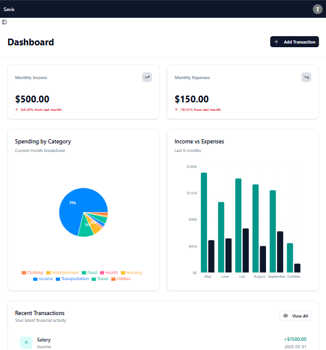

# 💰 budget-tracker

A modern and intuitive budget tracking application designed to help you manage your finances with ease and clarity.

[](https://github.com/hazlmendoza/budget-tracker)
[](https://unlicense.org/)
[](https://github.com/hazlmendoza/budget-tracker/stargazers)
[](https://github.com/hazlmendoza/budget-tracker/network/members)


## ✨ Features

*   📊 **Interactive Dashboards:** Visualize your spending habits with dynamic charts and graphs powered by Recharts.
*   📝 **Effortless Transaction Logging:** Quickly add and categorize your income and expenses using robust forms built with React Hook Form.
*   🎨 **Customizable Categories:** Personalize your budget by creating and managing custom spending categories.
*   🌙 **Theme Switching:** Seamlessly toggle between light and dark modes for a comfortable user experience.
*   ⚙️ **Modern UI Components:** Enjoy a sleek and responsive interface thanks to Radix UI components and Tailwind CSS.


## 🚀 Installation Guide

Follow these steps to get `budget-tracker` up and running on your local machine.

### Prerequisites

Ensure you have the following installed:

*   [Node.js](https://nodejs.org/en/) (LTS version recommended)
*   [npm](https://www.npmjs.com/) or [Yarn](https://yarnpkg.com/)

### Step-by-Step Installation

1.  **Clone the Repository:**

    ```bash
    git clone https://github.com/hazlmendoza/budget-tracker.git
    cd budget-tracker
    ```

2.  **Install Dependencies:**

    Using npm:
    ```bash
    npm install
    ```

    Or using Yarn:
    ```bash
    yarn install
    ```

3.  **Environment Configuration:**

    Create a `.env.local` file in the root directory of the project. While this project might not require specific API keys for basic functionality, it's good practice to have this file for future expansions (e.g., database connections, authentication).

    ```
    # Example .env.local content (adjust as needed)
    # NEXT_PUBLIC_API_URL=http://localhost:3001/api
    ```

4.  **Run the Development Server:**

    Start the development server:
    ```bash
    npm run dev
    ```

    Or using Yarn:
    ```bash
    yarn dev
    ```

    The application will now be running at `http://localhost:3000`.


## 💡 Usage Examples

Once the application is running, navigate to `http://localhost:3000` in your web browser.

*   **Add a Transaction:** Use the "Add New Transaction" form to input your income or expenses. Select a category, enter the amount, and add a description.
*   **View Dashboard:** The main dashboard provides an overview of your financial status, including total income, expenses, and a breakdown by category.
*   **Track Progress:** Monitor your financial goals and spending limits through visual progress indicators.




## 🗺️ Project Roadmap

We're continuously working to enhance `budget-tracker`. Here are some upcoming features and improvements:

*   **Version 1.1.0:**
    *   User authentication and multi-user support.
    *   Database integration for persistent data storage.
*   **Future Enhancements:**
    *   Setting budget limits for categories.
    *   Recurring transaction management.
    *   Mobile application (React Native).
    *   Internationalization support.


## 🤝 Contribution Guidelines

We welcome contributions from the community! To contribute to `budget-tracker`, please follow these guidelines:

1.  **Fork the Repository:** Start by forking the `budget-tracker` repository to your GitHub account.
2.  **Clone Your Fork:**
    ```bash
    git clone https://github.com/YOUR_USERNAME/budget-tracker.git
    cd budget-tracker
    ```
3.  **Create a New Branch:**
    ```bash
    git checkout -b feature/your-feature-name # For new features
    git checkout -b bugfix/issue-description # For bug fixes
    ```
4.  **Code Style:** Ensure your code adheres to the existing style. This project uses ESLint and Prettier (implied by `eslint.config.mjs` and common practices). Run linting before committing:
    ```bash
    npm run lint
    ```
5.  **Commit Changes:** Write clear, concise commit messages.
    ```bash
    git commit -m "feat: Add new transaction filtering option"
    ```
6.  **Push to Your Fork:**
    ```bash
    git push origin feature/your-feature-name
    ```
7.  **Open a Pull Request (PR):**
    *   Go to the original `budget-tracker` repository on GitHub.
    *   Click "New Pull Request" and select your branch.
    *   Provide a detailed description of your changes in the PR.
    *   Ensure all automated checks pass.


## ⚖️ License Information

This project currently has **no explicit license** chosen.

This means that by default, all rights are reserved by the copyright holder(s) (in this case, `hazlmendoza` as the main contributor). You are generally not permitted to use, copy, distribute, or modify this software without explicit permission.

It is highly recommended to choose an open-source license (e.g., MIT, Apache 2.0, GPL) to clarify usage rights for others.
